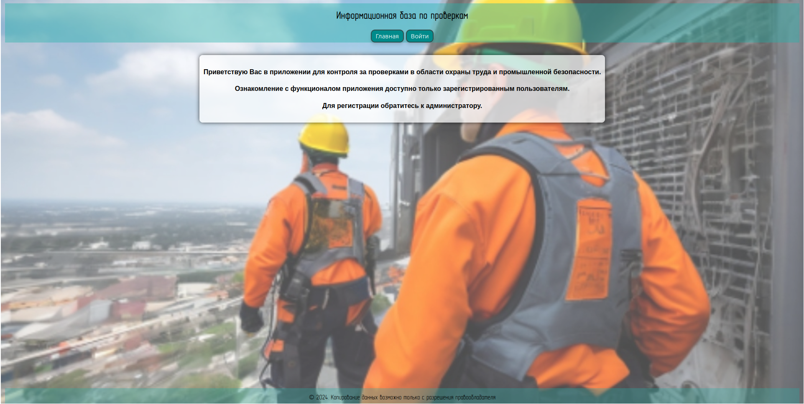
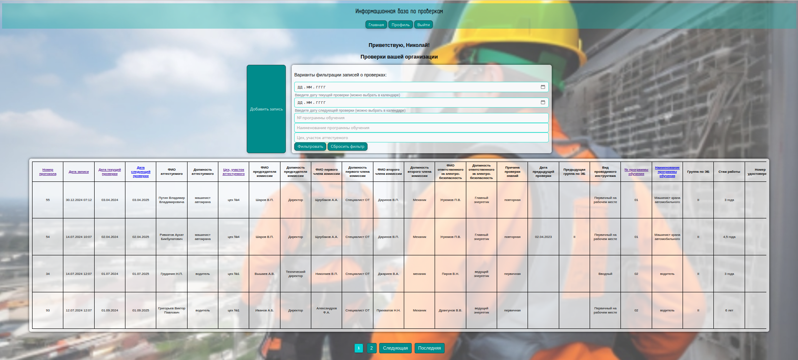
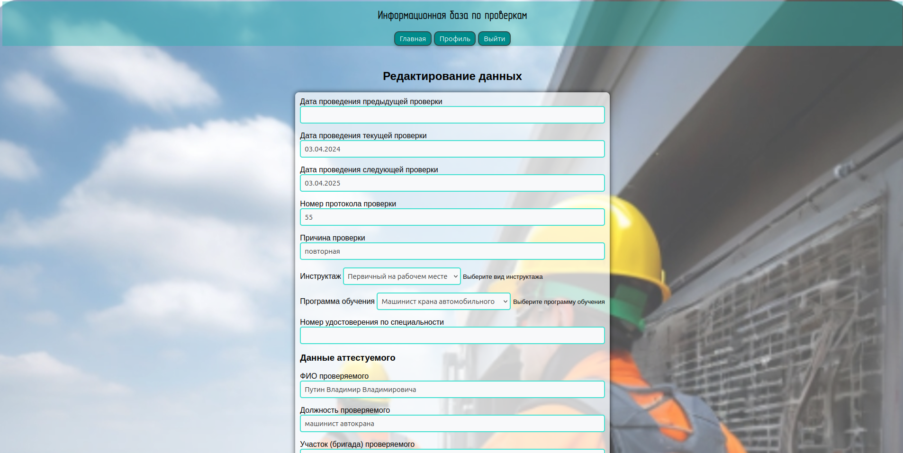
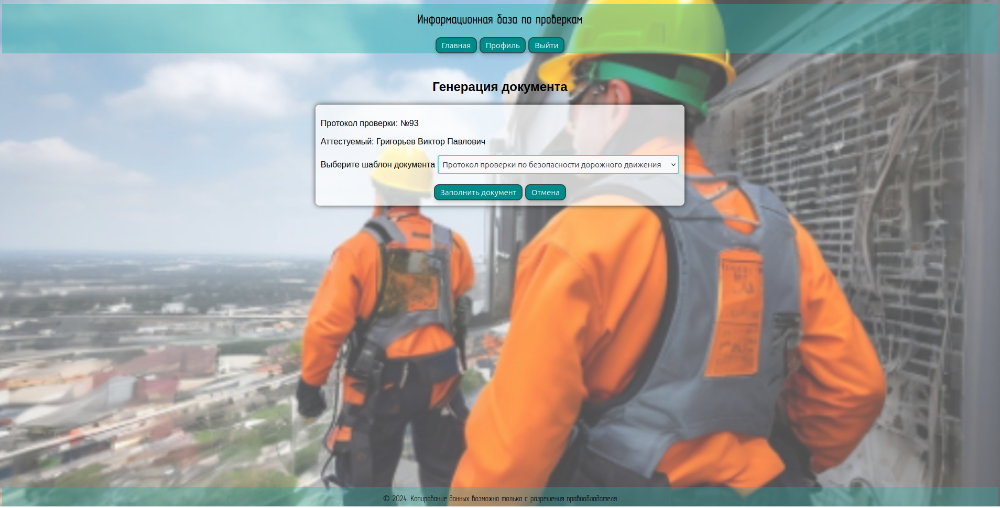
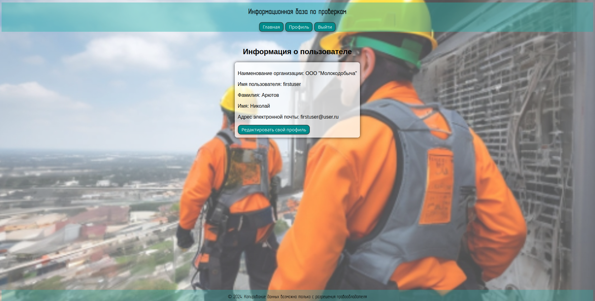
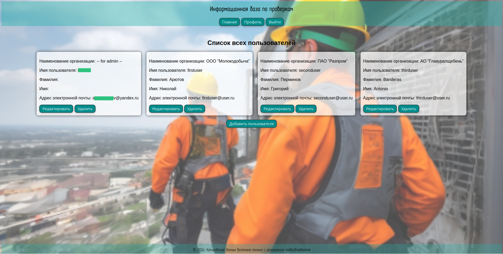

# База данных по охране труда

## Проект для ведения контроля над проверками по охране труда

Для зарегистрированных пользователей реализована база данных, в табличном виде, с информацией о проверках по охране труда сотрудников своей компании, с возможностью просмотра, дополнения и редактирования записей.
Есть возможность сортировки и фильтрации записей.

Также есть возможность генерировать документы (протоколы, удостоверения и т.п.) из шаблонов, используя информацию из определенной записи.

Авторизация в приложении доступна указанием логина, пароля и организации пользователя. Доступ к записям проверок своей компании имеют только зарегистрированные пользователи. Регистрация пользователя возможна только администратором. Для пользователя доступны просмотр и редактирование данных своего профиля.

Для администратора доступен просмотр профилей всех пользователей

### Стек технологий:
* *Python 3.12* 
* *Django 4.2.16* 
* *HTML 5* 
* *CSS 3* 
* *PostgreSQL* 
* *Redis 5.2.0* 
* *Pytest 8.3.4* 
* *Gunicorn 23.0.0* 
* *NGINX* 
* *Docker* 
* *Git* 
* *CI/CD GitHub Actions* 

Ознакомительная версия проекта доступна по адресу:

[База данных по охране труда](https://industrial-safety.sytes.net/)

Для ознакомления с функционалом можно использовать данные тестового пользователя: 

* Имя пользователя: *testuser*

* Пароль: *password345*

* Организация: *Тестовая* 

Пожалуйста, не засирайте базу беспорядочными записями. Относитесь к чужим проектам с уважением, как к своим. Спасибо!  

##### Не забудьте поставить "звездочку" :wink:

